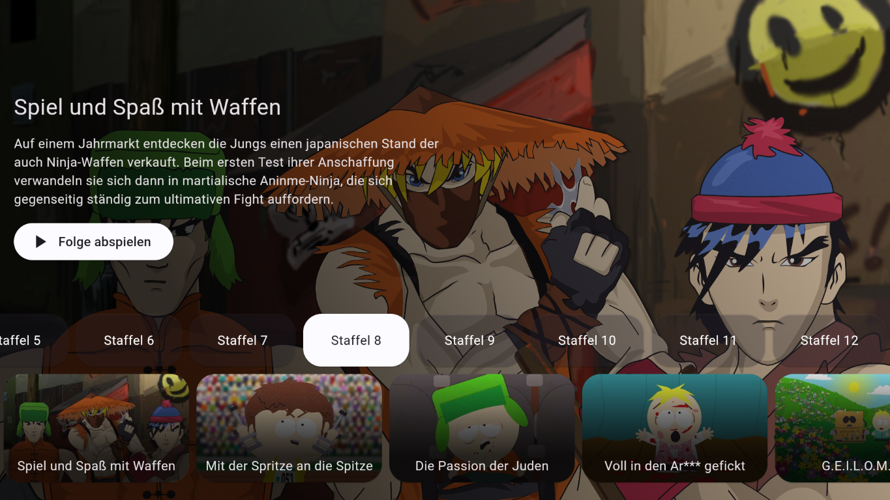
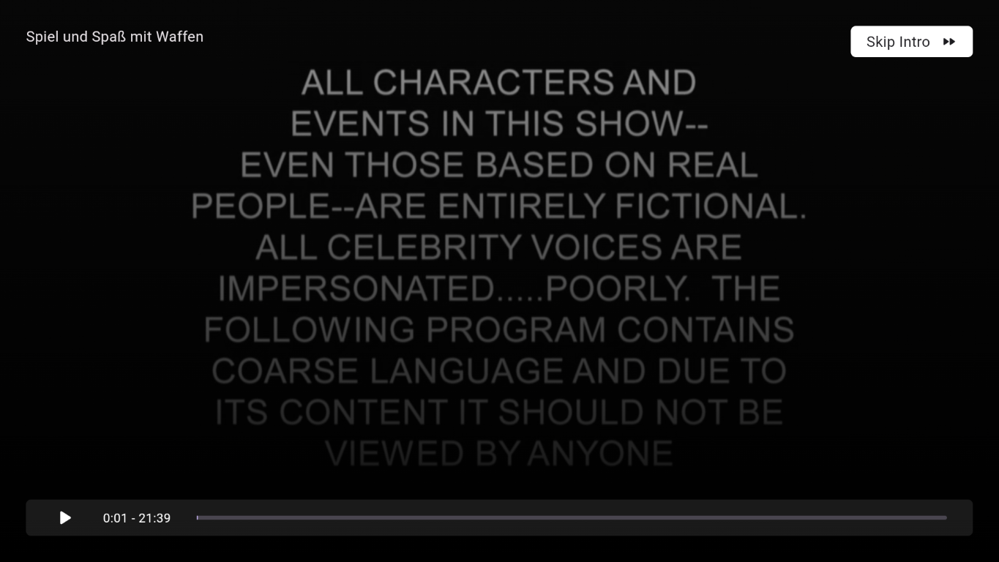

# KennyTV

A streaming app primarily developed for Android TV for the tv series South Park.

The app currently only supports episodes in german language, but multi-language is already planned (and being worked on).

## Downloads

You can find the latest APK in the relases section in this repository or by clicking [here](https://github.com/wabosh/KennyTV/releases/latest).

If you're not sure, which instruction set your device is using, download the apk without specified ABI, i.e. do not download the files with `armeabi-v7a`, `arm64-v8a` or `x86_64` in it.

## Features

These features are either already implemented or planned for future versions.

-   [x] Automatically scrape for seasons & episodes
-   [x] Episode selector in modern design
-   [x] Next episode button at end of episode
-   [x] Automatically play next episode on finish
-   [x] Skip-intro button
-   [ ] Remember last watched episode on exit
-   [ ] Language selection
-   [ ] i18n
-   [ ] Mobile version

## Screenshots

### Main menu



### Skip intro



### Next episode


## Contribution

You can contribute to this project in some ways:

1. Developing features or fixing bugs and merge them via pull requests
2. Reporting bugs and issues to the issues section of this repository

## Development

The app is developed in Flutter. You can learn more about it [here](https://flutter.dev/).

The code is mostly undocumented and uncommented and I'm not an expert in Flutter; please keep that in mind if you plan contributing to this project.

### Create keystore

I've replaced the default debugging keystore provided by Flutter with a self generated one.

You should generate it by running the following command in the project root.

#### Linux / MacOS
```bash
keytool -genkey -v -keystore upload-keystore.jks -keyalg RSA -keysize 2048 -validity 10000 -alias upload
```

#### Windows
```powershell
keytool -genkey -v -keystore upload-keystore.jks -storetype JKS -keyalg RSA -keysize 2048 -validity 10000 -alias upload
```


### Code generation

This project uses Riverpod and Freezed. These two libraries make it easier to avoid boilerplate code by using code generation.
You can automatically generate Riverpod & Freezed code by running

```
flutter pub run build_runner watch
```

## Disclaimer

This project is not affiliated, associated, authorized, endorsed by, or in any way officially connected with South Park Digital Studios LLC, MTV Networks, or any of their subsidiaries or their affiliates. The official South Park website, this project takes its content from, can be found at [http://www.southpark.de](http://www.southpark.de).

This project is developed and maintained by independent developers. The source code available here is intended for educational and research purposes only. Please ensure you comply with all applicable local, state, national, and international laws when using this software. The developer of this project assumes no responsibility for any misuse or damage caused by this software.

South Park, its characters, and its trademarks are the property of their respective owners.

## Additional Disclaimer Regarding Naming

"KennyTV" is named after Kenny McCormick, a character from South Park. This reference is purely for creative naming purposes and does not imply any official connection or endorsement by the creators or copyright holders of South Park. This project is independently created and does not represent the South Park brand in any official capacity.
